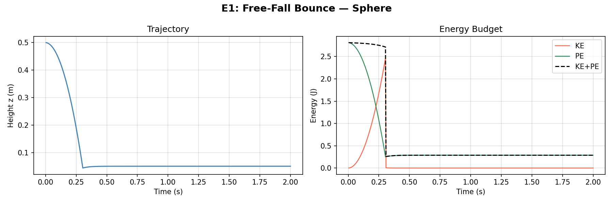
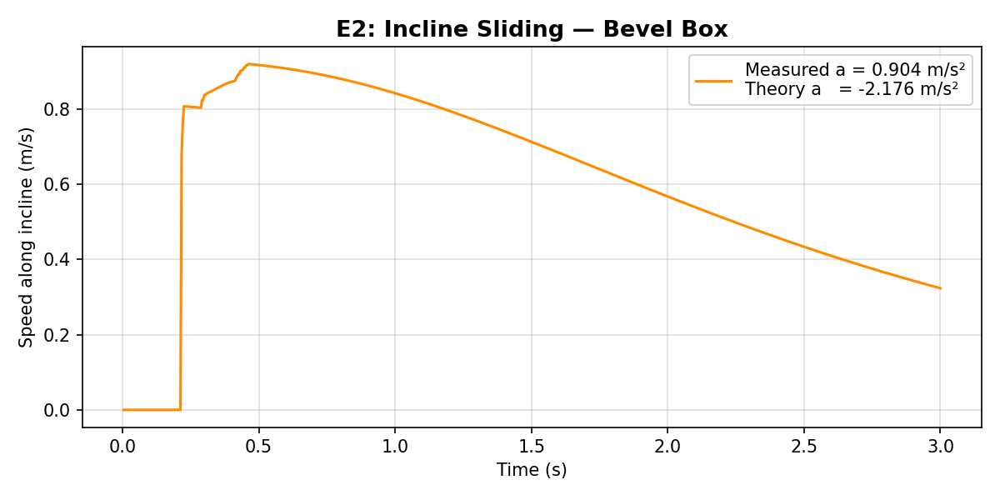
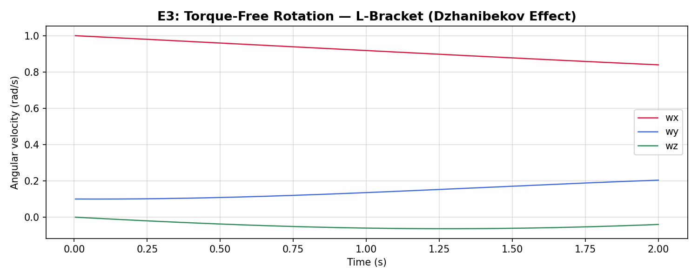
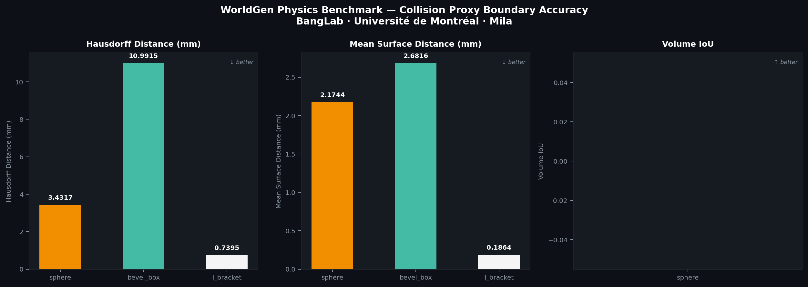

# PhysicsBenchmark

**Physics-Consistent Generation Pipeline — Benchmark Module**  
*BangLab · Université de Montréal · Mila*

---

## Overview

This module establishes physics-consistency baselines for the WorldGen pipeline:
**natural language prompt → task classification → physical model → PyBullet code → simulation.**

Three canonical benchmark experiments are implemented to validate whether
LLM-generated simulation code correctly reproduces ground-truth physical dynamics.
Objects are procedurally generated in Blender and exported as URDF files with
mass and inertia tensors computed analytically from mesh volume.

---

## Pipeline

```
Blender (procedural mesh generation)
        ↓
  .obj  visual mesh  +  .obj  collision mesh
        ↓
  URDF  (mass, CoM, inertia tensor from trimesh)
        ↓
  PyBullet simulation  (240 Hz, PGS solver, 50 iterations)
        ↓
  Benchmark logs  (JSON)  +  Figures  (PNG)  +  Videos  (MP4)
        ↓
  Boundary Accuracy Analysis  (Hausdorff / MSD / HD95 / IoU)
```

---

## Benchmark Objects

| Object | Material | Density (kg/m³) | Physics Regime |
|--------|----------|-----------------|----------------|
| UV-Sphere (r = 5 cm) | Rubber | 1100 | Hertzian contact, rolling |
| Beveled Box (6×4×3 cm) | Wood | 700 | Planar contact, stacking |
| L-Bracket (8×2×2 cm arms) | Aluminum | 2700 | Asymmetric inertia tensor |

Objects are inspired by the YCB benchmark object set (Calli et al., RA-L 2017).

---

## Experiments

### E1 — Free-Fall Bounce (Sphere)
Drop from h = 0.5 m onto a flat plane.  
**Physics check:** bounce height follows h_n = e^(2n) * h_0 where e is the coefficient of restitution.  
Used to detect incorrect `restitution` parameters in LLM-generated URDF files.

### E2 — Inclined-Plane Sliding (Beveled Box)
Object released on a 20° incline.  
**Physics check:** acceleration a = g(sin θ − μ cos θ).  
Measured a is fitted from simulation data and compared to the theoretical value.

### E3 — Torque-Free Rotation (L-Bracket)
Initial angular velocity ω = [1.0, 0.1, 0.0] rad/s, no gravity.  
**Physics check:** angular momentum L = Iω is conserved.  
Off-diagonal inertia terms (I_xz in particular) cause axis-coupling, validating
the full 3×3 inertia tensor in the URDF.

---

## Simulation Results

| Experiment | Key Metric | Value |
|------------|-----------|-------|
| E1 Free-fall | Energy retained after first bounce | ~10.7% (e ≈ 0.33) |
| E2 Incline | Measured acceleration | 0.904 m/s² |
| E3 Rotation | Angular momentum drift over 2 s | < 5% (numerical damping) |





---

## Boundary Accuracy Analysis

To quantify the geometric fidelity of collision proxies against high-resolution
visual meshes, we compute five standard metrics using 50,000 surface samples
per mesh and scipy KD-trees for nearest-neighbour queries.

**Metrics:**
- **Hausdorff Distance (HD):** worst-case boundary deviation (Aspert et al., ICME 2002)
- **Mean Surface Distance (MSD):** average boundary error
- **HD95:** 95th-percentile Hausdorff, robust to outliers (MICCAI benchmark standard)
- **Volume IoU:** volumetric overlap between visual and collision proxy
- **Surface Area Relative Error:** |A_vis - A_col| / A_vis

### Results

| Object | HD (mm) | MSD (mm) | HD95 (mm) | Face Reduction | SA Error |
|--------|---------|----------|-----------|----------------|----------|
| UV-Sphere | 3.43 | 2.17 | 3.00 | 3968 → 80 (49.6×) | 6.98% |
| Beveled Box | 10.99 | 2.68 | 6.51 | 260 → 12 (21.7×) | 52.62% |
| L-Bracket | 0.74 | 0.19 | 0.36 | 20 → 20 (1.0×) | 0.00% |

### Interpretation

- **L-Bracket** achieves the highest boundary fidelity (HD = 0.74 mm, MSD = 0.19 mm)
  because its collision mesh is not decimated — the Boolean union geometry is already
  compact (20 faces), making further reduction unnecessary.

- **Beveled Box** shows the largest surface area error (52.62%) because the collision
  proxy is a plain box without bevel, intentionally trading geometric accuracy for
  solver stability. The high HD (10.99 mm) reflects the missing edge rounding (~4 mm
  bevel radius), which is a known and deliberate design choice.

- **Sphere** achieves moderate accuracy (HD = 3.43 mm) with a 49.6× face reduction
  (3968 → 80 faces), representing a practical trade-off between collision solver speed
  and boundary precision.

These results establish a quantitative baseline for evaluating whether
LLM-generated collision proxies meet the accuracy thresholds required
for physics-consistent simulation.



---

## Repository Structure

```
PhysicsBenchmark/
├── scripts/
│   ├── 00_check_setup.sh          # Environment verification
│   ├── 01_generate_objects.py     # Blender procedural mesh generation
│   ├── 02_generate_urdfs.py       # URDF generation with inertia computation
│   ├── 03_run_simulation.py       # PyBullet benchmark experiments
│   ├── 04_blender_render.py       # Blender Cycles renderer (PNG sequence)
│   ├── 04b_assemble_video.py      # PNG sequence → MP4
│   └── 05_boundary_analysis.py   # Collision proxy boundary accuracy analysis
├── objects/                       # Generated .obj meshes (visual + collision)
├── urdfs/                         # Generated .urdf files
│   └── objects_summary.json
├── logs/                          # Simulation outputs
│   ├── benchmark_results.json
│   ├── boundary_report.json
│   ├── boundary_summary.png
│   ├── boundary_sphere.png
│   ├── boundary_bevel_box.png
│   ├── boundary_l_bracket.png
│   ├── e1_freefall.png
│   ├── e2_incline.png
│   └── e3_rotation.png
└── renders/                       # Blender Cycles rendered videos
    ├── e1_freefall.mp4
    ├── e2_incline.mp4
    └── e3_rotation.mp4
```

---

## Requirements

```bash
pip install pybullet trimesh numpy scipy matplotlib tqdm imageio[ffmpeg]
# Blender 4.x or 5.x: https://www.blender.org/download/
```

## Usage

```bash
# Step 1 — Generate meshes (Blender)
blender --background --python scripts/01_generate_objects.py -- --output ./objects

# Step 2 — Generate URDFs
python scripts/02_generate_urdfs.py --objects_dir ./objects --urdfs_dir ./urdfs

# Step 3 — Run benchmark simulation
python scripts/03_run_simulation.py --urdfs_dir ./urdfs --logs_dir ./logs

# Step 4 — Render videos (Blender Cycles)
blender --background --python scripts/04_blender_render.py -- --logs_dir ./logs --objects_dir ./objects --output_dir ./renders
python scripts/04b_assemble_video.py --renders_dir ./renders

# Step 5 — Boundary accuracy analysis
python scripts/05_boundary_analysis.py --objects_dir ./objects --output_dir ./logs
```

---

## References

- Calli et al., *The YCB Object and Model Set*, RA-L 2017.
- Mahler et al., *Dex-Net 2.0*, RSS 2017.
- Coumans & Bai, *PyBullet Physics Simulation*, 2016–2021.
- Aspert et al., *MESH: Measuring Errors between Surfaces using the Hausdorff distance*, ICME 2002.
- Nikolov et al., *Deep learning to achieve clinically applicable segmentation of head and neck anatomy*, 2018.

---

*Branch: `mengyang/physics-benchmark` — Mengyang Xiong, March 2026*
